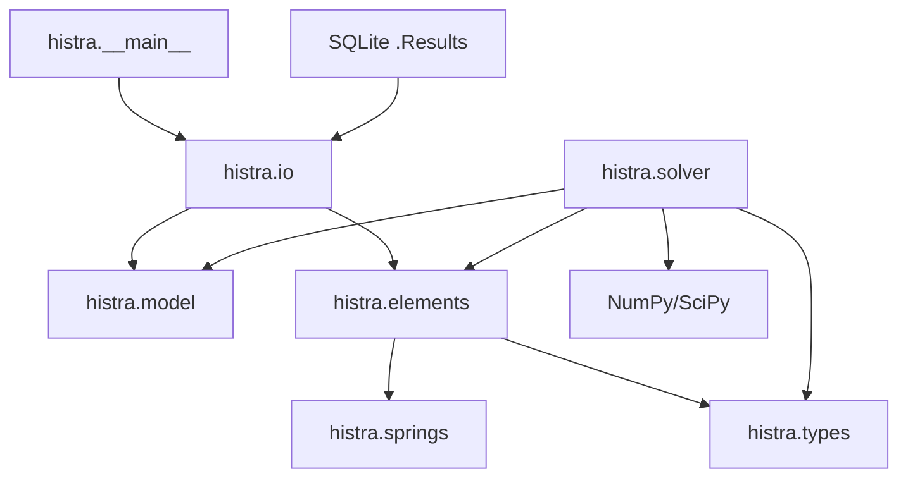

# Architecture

## Purpose

HiStrA Python is a direct port of a subset of a C# structural-analysis application. The runtime parses HRX data, assembles sparse systems, updates macro-elements and path-dependent springs, and performs static nonlinear analysis.

## Layers

## Main owners

| State | Owner |
|---|---|
| Schema/geometry/connectivity | `Model` and `Collections` |
| Global sparse matrix/residual/correction | `LinearSystem` |
| Analysis callbacks and global displacement | `Program` |
| Load factor, pseudo-time, step accumulation | Integrator |
| Local displacement/forces | Quad/Interface state |
| Trial and committed constitutive history | Spring instances |
| Reference/external load vectors | Currently `ModelManager` class state |

## Critical lifecycle distinction

An HRX file can serialize the last solved state. A new virgin analysis must reset that state. A chained analysis must instead restore one specific prior committed state from the results database. These are different operations and must never be approximated by merely setting the global displacement vector to zero.

## Current architectural constraints

- `ModelManager` class attributes make analysis state process-global and non-thread-safe.
- Element/spring state is mutable and has no general transaction/snapshot protocol.
- The Python model covers only a subset of C# entity/load families.
- Compatibility modules preserve historical imports but can obscure the canonical implementation location.

## Recommended direction

Introduce an `AnalysisContext` containing all global vectors and analysis state, plus typed snapshot/restore interfaces for elements and springs. Results-database restart should deserialize into the same context and committed-state protocol used by rollback.
