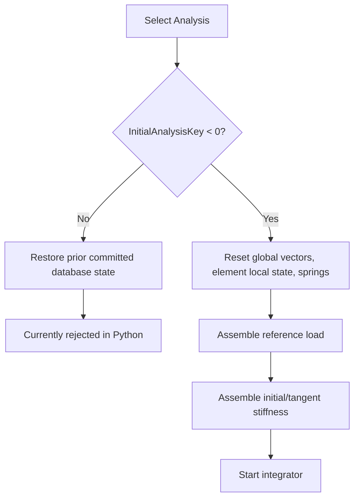

# Solver flow

## Loading a model

`load_model()` streams the HRX and builds `Model.collections`. It also:

- retains the absolute `Model.source_path`;
- joins `LoadFunctionItem` records to `LoadFunction`;
- parses `InitialAnalysisKey` and `InitialCombinationAnalysisKey`;
- attaches the selected load function to each analysis.

The HRX may contain saved solved state. Loading is not the same as initializing a new analysis.

## Nonlinear initialization

The C# flow chooses between virgin initialization and prior-analysis restoration.

Python implements the virgin branch for the supported quad/interface model. It rejects the restart branch until all history variables can be restored correctly.

## LoadControl/Newton sequence

1. Determine the next pseudo-time and load-multiplier increment.
2. Add the external load increment.
3. Form `R = F_external - F_internal` (plus supported additions).
4. For Standard methods, rebuild tangent stiffness; Modified methods reuse initial stiffness.
5. Solve for the global correction.
6. Add the correction to global and element-local trial state.
7. Update constitutive springs.
8. Re-form residual.
9. Optionally perform line-search trial corrections.
10. Test force, displacement, or work convergence.
11. Commit accepted element/spring state, or rollback on failure.

## First-step C# alignment

Virgin-state reset is essential. Without it, the first correction is added to the solved state stored in HRX. With the reset, the first analysis-1 step matches the C# database closely.

## Remaining divergence point

C# `Quad.UpdateDomain` computes normal-force change and initial normal stress before updating `SpringCoulomb03`. Python currently omits that computation. Later nonlinear steps therefore do not yet follow the same constitutive path.

## ALS

On a failed LoadControl step, the implementation:

1. removes the failed full load increment;
2. reverts to the last committed state;
3. tries reduced subincrements;
4. commits each successful substep;
5. reverts a failed substep before reducing again.

This follows the inspected C# sequence, but it still depends on correct element constitutive state.

## ArcLength

The C#-aligned ArcLength implementation uses residual and reference-load solutions, accumulated step displacement, a control/all-DOF constraint, and load-function direction. End-to-end validation is blocked because the supplied ArcLength analyses restart from earlier analyses whose complete database state is not yet restorable.
